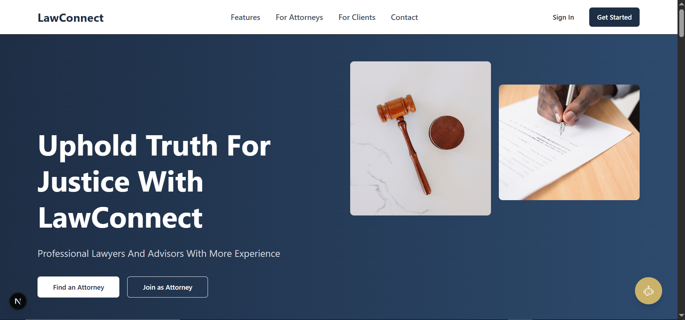
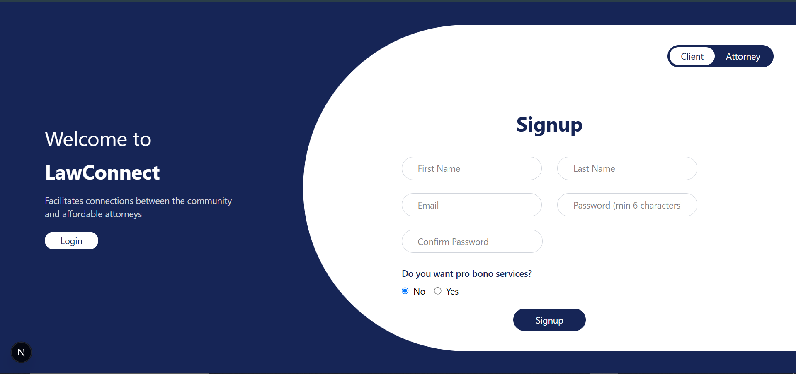
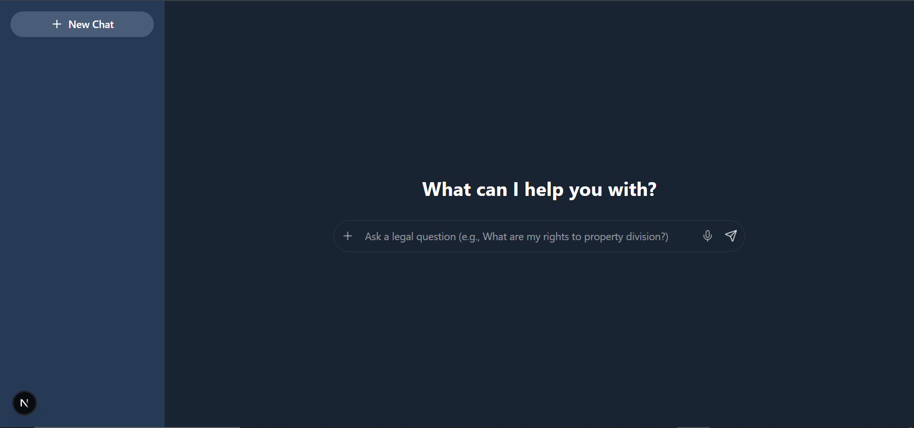

# Smart Legal Assistance Platform

This directory contains GitHub Actions workflows that automate various processes for the Smart Legal Assistance Platform.

## Tech Stack

- **Frontend:** Next.js, Tailwind CSS  
- **Backend:** Django (see the `main-backend` branch)

## 🌐 Backend Deployment
The backend is deployed and available at:  
👉 [https://main-backend-aan1.onrender.com](https://main-backend-aan1.onrender.com)

> 🔁 **Note:** The backend code is located on a separate branch named `main-backend`.

## Running the Frontend Locally

To run the frontend web app on your local machine:

```bash
git clone https://github.com/AASTUSoftwareEngineeringDepartment/SmartLegalAssistanceAttorneyFindingPlatform.git
cd your-repo-name
npm install
npm run dev
```

Then visit `http://localhost:3000` in your browser.

## Workflows

### Docker Build and Push

**File:** `.github/workflows/docker-build.yml`

This workflow automatically builds and pushes Docker images for the backend whenever changes are made to Python files, `requirements.txt`, `Dockerfile`, or `docker-compose.yml`.

#### What it does:

1. Triggers on pushes to the `main` branch and pull requests to `main`
2. Builds the Docker image using the `Dockerfile`
3. Tags the image with both the commit SHA and `latest`
4. Pushes the image to DockerHub (only for pushes to `main`, not pull requests)
5. Runs basic tests to ensure the build is functional
6. Updates the deployment via Render webhook (if configured)

#### Dockerfile Overview

The Dockerfile is based on `python:3.12-slim` and:

- Installs system dependencies such as `build-essential` and `libpq-dev`
- Sets environment variables for optimized Python behavior
- Installs Python packages from `requirements.txt`
- Copies all project files into the container
- Sets the working directory to `/app/backend`
- Automatically runs Django migrations and launches the app using Gunicorn

```dockerfile
FROM python:3.12-slim

ENV PYTHONDONTWRITEBYTECODE 1
ENV PYTHONUNBUFFERED 1

WORKDIR /app

RUN apt-get update && apt-get install -y \
    build-essential \
    libpq-dev \
    && rm -rf /var/lib/apt/lists/*

COPY requirements.txt /app/
RUN pip install --upgrade pip
RUN pip install -r requirements.txt

COPY . /app/
WORKDIR /app/backend

CMD ["sh", "-c", "python manage.py makemigrations && python manage.py migrate && gunicorn legal.wsgi:application --bind 0.0.0.0:$PORT"]
```

#### Required Secrets:

To use this workflow, you need to set up the following secrets in your GitHub repository:

- `DOCKERHUB_USERNAME`: Your DockerHub username
- `DOCKERHUB_TOKEN`: Your DockerHub access token (not your password)
- `RENDER_DEPLOY_HOOK`: The webhook URL provided by Render for automatic deployments

#### How to set up secrets:

1. Go to your GitHub repository
2. Navigate to **Settings > Secrets and variables > Actions**
3. Click **"New repository secret"**
4. Add each of the required secrets

## Troubleshooting

If the workflow isn't working as expected:

1. Check that you've added all required secrets
2. Verify your DockerHub credentials are correct
3. Make sure your `Dockerfile` is valid and builds successfully locally
4. Check the GitHub Actions logs for any specific error messages 

## 📸 App Screenshots

### Landing Page


### Attorney and Client Signup


### AI Chatbot


